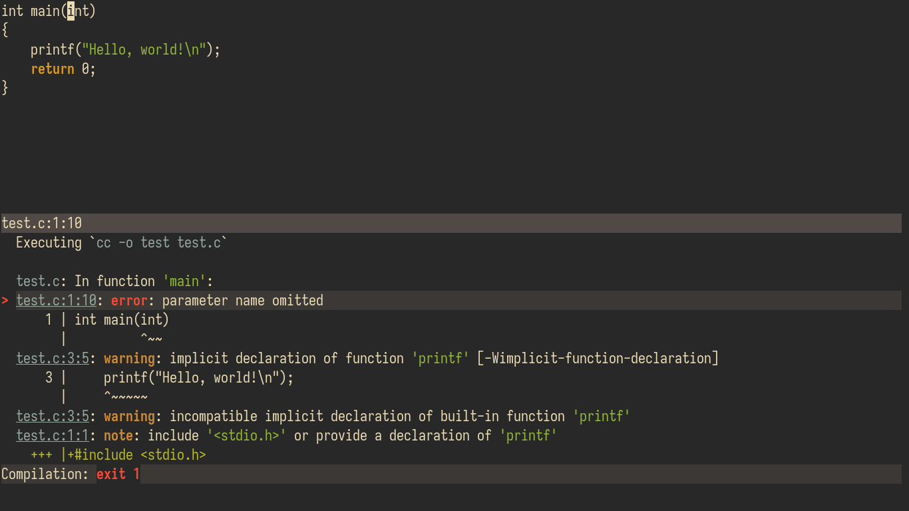

# Compilation Integration


Inspired by `M-x compile` in Emacs.

## Install

### Plugin Managers
```vim
" Vim plug
Plug 'shoumodip/compile.nvim'

" Vundle
Plugin 'shoumodip/compile.nvim'

" Dein
call dein#add('shoumodip/compile.nvim')

" Minpac
call minpac#add('shoumodip/compile.nvim')
```

### Manual
```sh
# Pathogen
cd ~/.config/nvim/bundle && git clone https://github.com/shoumodip/compile.vim

# Builtin package system
cd ~/.config/nvim/pack/plugins/start && git clone https://github.com/shoumodip/compile.vim
```

## Quick Start
| Name           | Description                   |
| -------------- | ----------------------------- |
| `:Compile`     | Start a compilation command   |
| `:CompileNext` | Jump to the next location     |
| `:CompilePrev` | Jump to the previous location |

## How to use
Just issue `:Compile` in command-mode. It will open an interactive command selection prompt with the previous command you executed being automatically selected.

It will open a split (`g:compile#open_commmand`) and execute the function with the following debug info:

- The command
- Time taken
- Exit code

After the execution has finished, there are three keys you can press.

- `q` Quit the compilation window
- `r` Rerun the command
- `e` Edit the command and run the new one

## Filename
By the way `compile.nvim` supports filename expansions (`%`). See `:h filename-modifiers` for more information. If you wish to use a literal `%` in your command use `\%`.

## Configuration
Set these options wherever and whenever you want.

- `g:compile#open_command` The command used for opening the compilation window. Defaults to `split`.
- `g:compile#previous_command` The command used in the previous compilation window and offered as a suggestion during the input. Blank by default.

## Highlights
- `compileBad` links to `WarningMsg`
- `compileGood` links to `Function`
- `compileLabel` links to `Identifier`
- `compileFile` links to `Special`
- `compileCommand` links to `Function`
- `compilePrompt` links to `Function`

## `:Compile`
The `:Compile` command can also take an argument as a string. In that case, it will not prompt the user for the command, but rather execute the argument as the command.

Syntax:
- `:Compile <command>`

## Prerequisites
- The `sh` interpreter (`Bash`, `Dash`, whatever)
