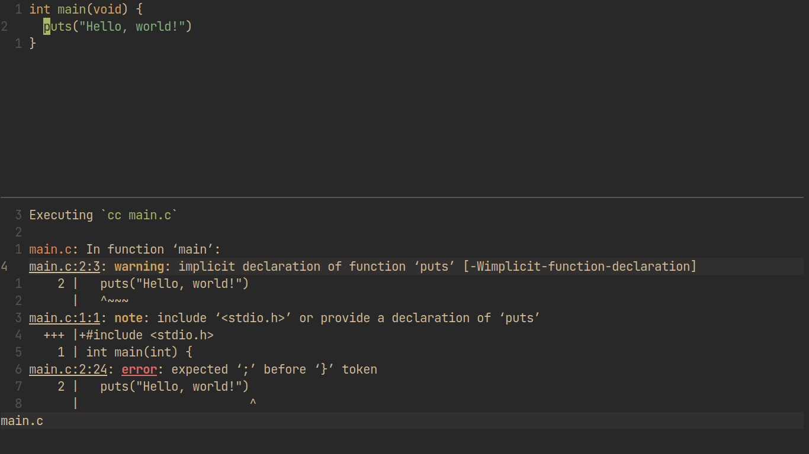

# compile.nvim


Compilation integration for Neovim

## Quick Start
```vim
Plug 'shoumodip/compile.nvim'
```

| Name           | Description                   |
| -------------- | ----------------------------- |
| `:Compile`     | Start a compilation command   |
| `:CompileNext` | Jump to the next location     |
| `:CompilePrev` | Jump to the previous location |
| `:Recompile`   | Rerun the compilation command |

The `:Compile` command can also take an argument as a string. In that case, it will not prompt the user for the command, but rather execute the argument as the command.

```vim
:Compile <command>
```

## Keybindings
| Key     | Description                       |
| ------- | --------------------------------- |
| `r`     | Restart the compilation process   |
| `]e`    | Open the next error at column     |
| `[e`    | Open the previous error at column |
| `]E`    | Open the next error               |
| `[E`    | Open the previous error           |
| `<cr>`  | Open the error under the cursor   |
| `<c-c>` | Stop the process                  |

Keybindings can be customized.

```lua
local compile = require("compile")
compile.bind {
  ["n"] = compile.next,    -- Open the next error
  ["p"] = compile.prev,    -- Open the previous error
  ["o"] = compile.this,    -- Open the error under the cursor
  ["r"] = compile.restart, -- Restart the compilation process
  ["q"] = compile.stop,    -- Stop the compilation process
}
```
