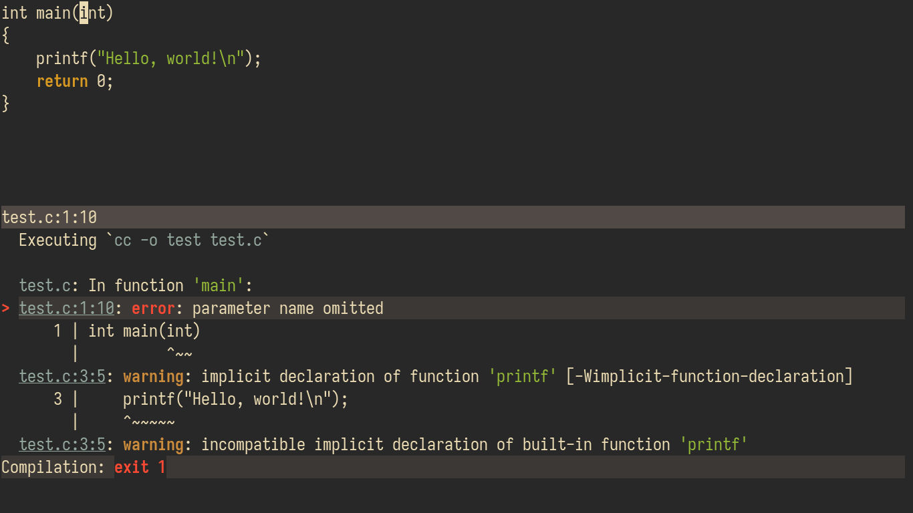

# compile.nvim


Compilation integration for Neovim

## Quick Start
```vim
Plug 'shoumodip/compile.nvim'
```

| Name                     | Description                                        |
| ------------------------ | -------------------------------------------------- |
| `:Compile`               | Start a compilation command                        |
| `:CompileNext`           | Jump to the next location                          |
| `:CompilePrev`           | Jump to the previous location                      |
| `:CompileNextWithCol`    | Jump to the next location with column              |
| `:CompilePrevWithCol`    | Jump to the previous location with column          |
| `:CompilePattern`        | Set the compiler error location format             |
| `:CompilePatternWithCol` | Set the compiler error location format with column |
| `:Recompile`             | Rerun the compilation command                      |

The `:Compile` command can also take an argument as a string. In that case, it will not prompt the user for the command, but rather execute the argument as the command.

```vim
:Compile <command>
```

## Keybindings
| Key     | Description                       |
| ------- | --------------------------------- |
| `r`     | Restart the compilation process   |
| `]e`    | Open the next error at column     |
| `[e`    | Open the previous error at column |
| `]E`    | Open the next error               |
| `[E`    | Open the previous error           |
| `<cr>`  | Open the error under the cursor   |
| `<c-c>` | Stop the process                  |

Keybindings can be customized.

```lua
local compile = require("compile")
compile.bind {
  ["n"] = compile.next,    -- Open the next error
  ["p"] = compile.prev,    -- Open the previous error
  ["o"] = compile.open,    -- Open the error under the cursor
  ["r"] = compile.restart, -- Restart the compilation process
  ["q"] = compile.stop,    -- Stop the compilation process
}
```

## Lua API
```lua
local compile = require("compile")
```

### `compile.start(cmd?)`
Execute `cmd` as a compilation process.

### `compile.open()`
Open the file location under the cursor.

### `compile.next_with_col(prev?)`
Open the next file location with mandatory column number.

If the argument `prev` is provided with a "true" value, then it opens the previous error instead.

### `compile.prev_with_col()`
Open the previous file location with mandatory column number.

### `compile.next(prev?)`
Open the next file location.

If the argument `prev` is provided with a "true" value, then it opens the previous error instead.

### `compile.prev()`
Open the previous file location.

### `compile.restart()`
Restart the compilation process.

### `compile.stop()`
Stop the compilation process.

### `compile.add_pattern(name, with_col?, without_col?, use?)`
Add a output format for error locations.

If either of `with_col` or `without_col` are not provided, then the one that is provided will be used as a fallback.

If both are not provided, then nothing will happen.

If `use` is provided as a "true" value, then this pattern will be set as the current pattern.

### `compile.use_pattern(name?)`
Set the current pattern.

If `name` is not provided, then it will be selected using the nvim native selection popup (`vim.ui.select`)
