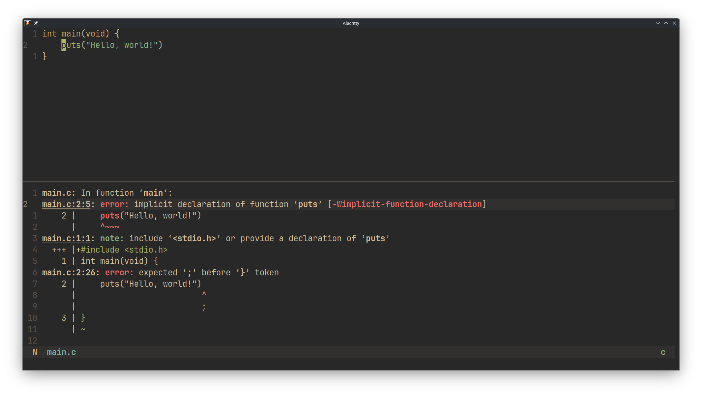

# compile.nvim


Compilation integration for Neovim

## Quick Start
```vim
Plug 'shoumodip/compile.nvim'
```

| Name                    | Description                                     |
| ----------------------- | ----------------------------------------------- |
| `:Compile`              | Start a compilation command                     |
| `:CompileNext`          | Jump to the next location                       |
| `:CompilePrev`          | Jump to the previous location                   |
| `:Recompile`            | Rerun the compilation command                   |

The `:Compile` command can also take an argument as a string. In that case, it
will not prompt the user for the command, but rather execute the argument as
the command.

```vim
:Compile <command>
```

## Keybindings
| Key     | Description                                 |
| ------- | ------------------------------------------- |
| `s`     | Switch error patterns                       |
| `r`     | Restart the compilation process             |
| `]e`    | Open the next error                         |
| `[e`    | Open the previous error                     |
| `<cr>`  | Open the error under the cursor             |
| `<c-c>` | Stop the process                            |

## Configuration

```lua
local compile = require("compile")
compile.setup {
    bindings = {
        ["n"] = compile.next,    -- Open the next error
        ["p"] = compile.prev,    -- Open the previous error
        ["o"] = compile.open,    -- Open the error under the cursor
        ["r"] = compile.restart, -- Restart the compilation process
        ["q"] = compile.stop,    -- Stop the compilation process
    },

    patterns = {
        -- A string can be provided as the pattern
        Odin = "\\(\\f\\+\\)(\\(\\d\\+\\):\\(\\d\\+\\))",

        -- By default, the submatches 1, 2, and 3 are considered the path, row, and column respectively.
        -- But you can customize that.
        Foo = {
            -- The hypothetical foo compiler emits diagnostics as "COLUMN -- PATH:ROW"
            "\\(\\d\\+\\) -- \\(\\f\\+\\):\\(\\d\\+\\)",
            col = 1,  -- The first submatch
            path = 2, -- The second submatch
            row = 3,  -- The third submatch
        },

        -- See ':h matchlist()' and ':h submatch()' if you don't know the concept of submatches.
    }
}
```

## Lua API
```lua
local compile = require("compile")
```

### `compile.start(cmd?)`
Execute `cmd` as a compilation process.

### `compile.open()`
Open the file location under the cursor.

### `compile.next()`
Open the next file location.

### `compile.prev()`
Open the previous file location.

### `compile.restart()`
Restart the compilation process.

### `compile.stop()`
Stop the compilation process.

### `compile.pattern(name?)`
Set the current pattern.

If `name` is not provided, then it will be selected using the nvim native selection popup (`vim.ui.select`)
