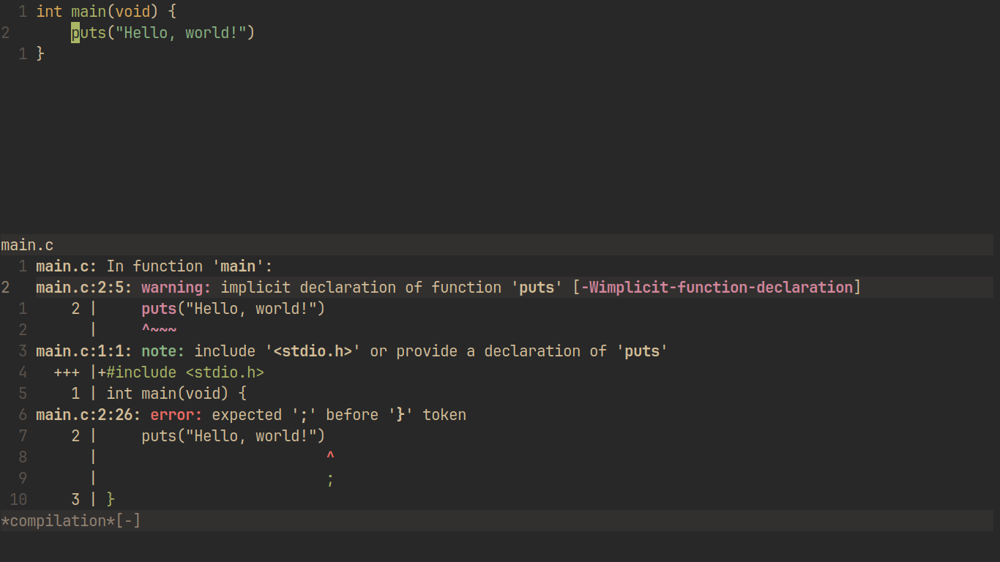

# compile.nvim


Compilation integration for Neovim

## Quick Start
```vim
Plug 'shoumodip/compile.nvim'
```

| Name                    | Description                                     |
| ----------------------- | ----------------------------------------------- |
| `:Compile`              | Start a compilation command                     |
| `:CompileNext`          | Jump to the next location                       |
| `:CompilePrev`          | Jump to the previous location                   |
| `:CompileNextSecondary` | Jump to the next location secondary pattern     |
| `:CompilePrevSecondary` | Jump to the previous location secondary pattern |
| `:Recompile`            | Rerun the compilation command                   |

The `:Compile` command can also take an argument as a string. In that case, it will not prompt the user for the command, but rather execute the argument as the command.

```vim
:Compile <command>
```

## Keybindings
| Key     | Description                                 |
| ------- | ------------------------------------------- |
| `s`     | Switch error patterns                       |
| `r`     | Restart the compilation process             |
| `]e`    | Open the next error                         |
| `[e`    | Open the previous error                     |
| `]E`    | Open the next error (secondary pattern)     |
| `[E`    | Open the previous error (secondary pattern) |
| `<cr>`  | Open the error under the cursor             |
| `<c-c>` | Stop the process                            |

## Configuration

```lua
local compile = require("compile")
compile.setup {
    bindings = {
        ["n"] = compile.next,    -- Open the next error
        ["p"] = compile.prev,    -- Open the previous error
        ["o"] = compile.open,    -- Open the error under the cursor
        ["r"] = compile.restart, -- Restart the compilation process
        ["q"] = compile.stop,    -- Stop the compilation process
    },

    patterns = {
        -- A string can be provided as the singular primary pattern
        Odin = "[<path>]([<row>]:[<col>])",

        -- Or, it can be be more detailed
        Rust = {
            "[<path>]:[<row>]:[<col>]", -- Primary pattern
            "[<path>]:[<row>]",         -- Secondary pattern
            use = true                  -- Set this as default
        },

        Python = 'File "[<path>]", line [<row>]',
    }
}
```

## Lua API
```lua
local compile = require("compile")
```

### `compile.start(cmd?)`
Execute `cmd` as a compilation process.

### `compile.open()`
Open the file location under the cursor.

### `compile.next()`
Open the next file location.

### `compile.prev()`
Open the previous file location.

### `compile.next_secondary(prev?)`
Open the next file location (secondary pattern).

### `compile.prev_secondary()`
Open the previous file location (secondary pattern).

### `compile.restart()`
Restart the compilation process.

### `compile.stop()`
Stop the compilation process.

### `compile.add_pattern(name, primary?, secondary?, use?)`
Add a output format for error locations.

If either of `primary` or `secondary` are not provided, then the one that is provided will be used as a fallback.

If both are not provided, then nothing will happen.

If `use` is provided as a "true" value, then this pattern will be set as the current pattern.

**NOTE:** Use `[<path>]`, `[<row>]`, and `[<col>]` specifically to denote the meanings as such.

**Example:** `"[<path>]:[<row>]:[<col>]:"`.

### `compile.use_pattern(name?)`
Set the current pattern.

If `name` is not provided, then it will be selected using the nvim native selection popup (`vim.ui.select`)
